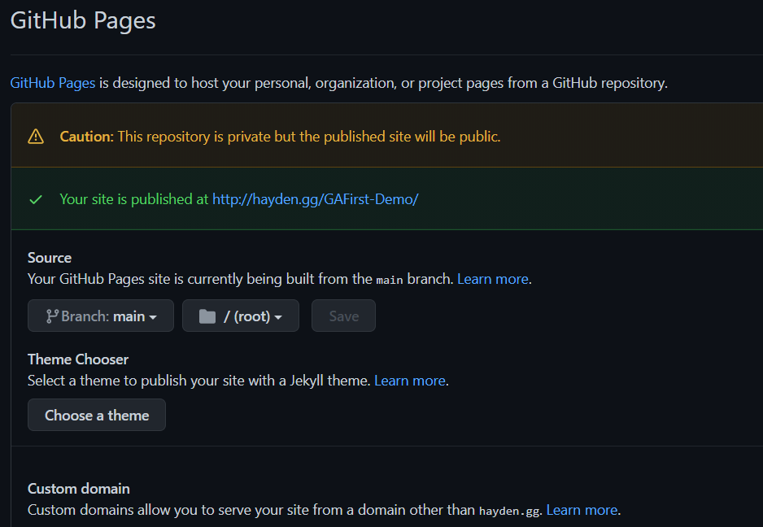

Personal websites are a great way to not only establish yourself on the internet but also to showcase whatever projects you're working on. They're great for portfolios, resumes, tools, and more. The sky's the limit.

Many people turn to website creators like Wix or Squarespace to accomplish this. The main problems with those solutions are:

* They don't showcase that you can create a website yourself.
* They aren't very customizable.
* They aren't unique.
* They have limited script capabilities.
  This makes them good for places to quickly put information to showcase to the internet but makes it bad for showing off yourself and your coding abilities. 

In my opinion, if you can code, you should try to make your website without using a builder.

So how would you go about that?

# GitHub Pages

**GitHub Pages** is a feature that GitHub offers to automatically publish your repository to a website hosted by GitHub. It can host any content that doesn't require a web server to run. The service is subject to usage limits that you can find on the information page linked [here](https://docs.github.com/en/github/working-with-github-pages/about-github-pages).

Example configuration in a GitHub repository's settings:

As you can see, you can also host GitHub Pages sites from your own domain.

I personally use it to host many projects and demos that only require showing off Javascript and CSS. This is where the service really shines, as it's as simple to set up as changing a setting in the GitHub repository that stores the files. 

# Web Frameworks

Web frameworks are essentially foundational code you can use to create websites more efficiently. They contain ways to allow you to iterate and develop a solution faster. Instead of re-inventing existing technologies like HTTP request handling, database management and image optimization, web frameworks give you an infrastructure you can use so you can focus on creating the user experience.

Without web frameworks, creating websites would take upwards of thousands of hours longer to create.

That being said, not all websites require a web framework. If you're hosting web content that's simple and unchanging, it's not necessary. You can just write raw HTML, Javascript, and CSS and push it to something like Github Pages, or use a website builder. However, if you're doing anything complex, a web framework can save you time.

Other benefits of web frameworks:

* Well-organized from the get-go
* Keeps flexibility and customizability 
* Many security problems are fixed due to web frameworks largely being open-sourced.
* Well supported
* Well documented
* Easy setup
* Great for team projects