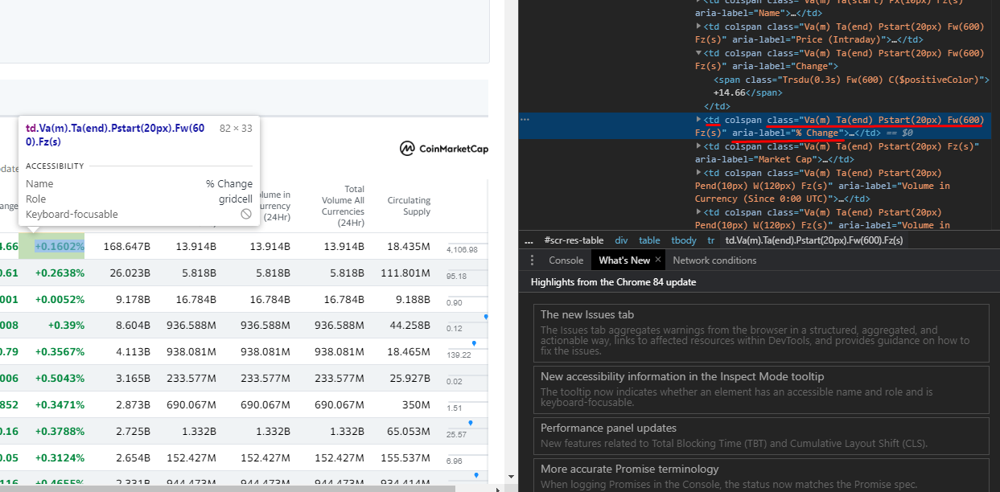

## What are you trying to accomplish?
The first thing you need to know is what you are trying to scrape from a webpage.  
Is it the url, the content, a specific element on the page...?

The answer to that question will allow you to get started.

Let's take Yahoo Finance for example.

I want to the percent change in value from Yahoo Finances Cryptocurrency page
(<https://finance.yahoo.com/cryptocurrencies>).

To allow my scraper to easily find this data, I'm going to find the element in the HTML that this part of data corresponds to.

That gave me some good information. It may look a little crazy, but I know the data I'm looking for is going to be in a &lttd&gt element.  
I also know the data is going to have the class "Va(m)" among others, and the aria-label "% Change".

Okay! We're probably good to get started!

## Creating the file

For this course, we're going to use Selenium.  
Selenium is a package that acts as a headless web browser.  
It allows you to act as a browser, even when you aren't one without much hassle during setup.
Other methods could be faster, but we aren't making thousands of requests per second.

Selenium is going to require a web driver. 

Previously, I would have suggested PhantomJS, however the project seems to have been abandoned :(

Instead, we're going to use a headless version of Chrome. We want to enable headless mode because otherwise the browser would popup every time we wanted to make a request and that would get annoying.

> Chromium WebDriver: <https://sites.google.com/a/chromium.org/chromedriver/downloads>